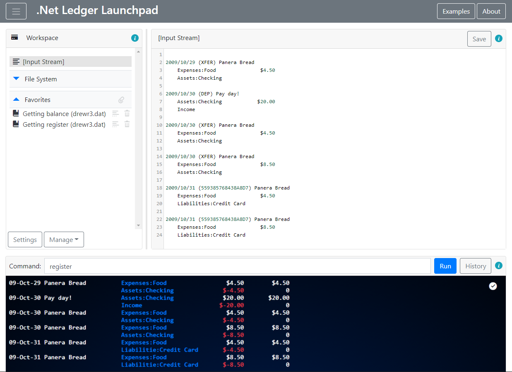
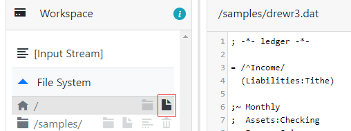

# .Net Ledger Launchpad
`.Net Ledger Web Browser Application` lets you interactively process your `Ledger` files just in your browser. You can put your data and immediately execute any Ledger command. No limitations and no additional software.

> [Ledger](https://www.ledger-cli.org/) is a powerful double-entry accounting system. You can find more information [here](https://github.com/ledger/ledger).

The application is built over [Blazor](https://dotnet.microsoft.com/apps/aspnet/web-apps/blazor) framework that lets us create browser web applications using C# instead of JavaScript. Basically, Blazor uses WebAssembly technology to run .Net runtime inside the browser; it also allows to include any other .Net libraries like `.Net Ledger`.

 The application uses [.Net Ledger](https://github.com/dmitry-merzlyakov/nledger) library to process data. It functionally equals to the original `Ledger` tool, so you have no limitations in commands or data files; it works like you run the original software.

 Hereby, you have a lightweight web application that is always available by this link: [https://dmitry-merzlyakov.github.io/nledger-launchpad](https://dmitry-merzlyakov.github.io/nledger-launchpad/). It is highly compatible to the original Ledger, so you can try any commands with any your data. It respects your privacy very match: your data is processed strongly on your computer; the application never uploads your data to the server (actually, the hosting contains static files only).

 Some helping features are intended to make your experience better (text editor with syntax highlighting, virtual file system to keep your files in the local browser file storage, favorites to remember your preferable commands, configurable virtual environment and management functions). It's worth mentioning a collection of examples (data files and commands) that the application provides; they are intended to illustrate a variety of Ledger features.

 > Remember, all your changes are kept in the local browser storage. There are import/export options that let you replicate your environment if you need it.

 Here is an example of `register` command output:

It should be noted that data processing performance in Blazor application is not so fast as native CLR, and managing data files bigger than 100K might be not comfortable (see "Performance Considerations" below).  

Thus, this application might be a good option to test Ledger functions when the original tool is not available; e.g. when someone wants to explore Ledger capabilities before installing it. It might be a good testing platform with a collection of your samples. There are no obstacles to organize even a regular accounting process by means of this tool if your data files are relatively small. If you want more - you are welcome to check capabilities of native command line tools!

## Getting Started

> Prerequisites: your browser must support WebAssembly technology. You can check browser compatibility table [here](https://developer.mozilla.org/en-US/docs/WebAssembly).

Open this link: [https://dmitry-merzlyakov.github.io/nledger-launchpad](https://dmitry-merzlyakov.github.io/nledger-launchpad/). It is the only needed action; the application is ready to go immediately once it is open.

There are a few typical scenarios below you may want to try.

### Execute commands 
- Open the application
- Type 'bal' or 'reg' in `Command` box and click `Run`

When the application is open for the first time; it is positioned to `Input Stream` (synonym for */dev/stdin*) that contains a sample data (shown in the text editor). Your commands will be executed for this sample data

- Change sample data (e.g. change $20.00 to $25.00) and click `Save`
- Execute the commands again and notice differences

> Important: do not add `-f` option to commands; it is added automatically according to the selected virtual file or input stream.

### Check examples
- Open the application
- Click `Examples` button; select one or more examples and click `Download`
- Expand `Favorites` and click on any of them

The downloaded examples appears as favorite items; referenced data files will be added to the local `File System`. When you click on a favorite, the system selects the referenced file (notice changes in the text editor title and content) and executes the command (check Command box)

### Add an own file
- Open the application
- Expand `File System`, navigate to the root folder and click on `Add File` button

- Enter a file name (e.g. `mydemo.txt`) and click Create

The system will create a new file with a default content. Notice that the new file is selected and you can change the content in the text editor.

- Copy&Paste any your data file to the text editor
- Run commands (check that your file is selected; enter command in Command box; click Run)

### Reset the environment
If you want to delete your data from the local storage or if you just want to reset the application to the original state, follow the steps:
- Open the application
- Click `Manage` button
- Click `Reset` option; confirm your decision

In all, I would tell that you can do whatever you want: play with the tool, try whatever you want - you can reset your data and start again anytime. Have fun!

## Basic Features
- Complete support of Ledger capabilities; you can execute any command;
- Virtual File System that keeps data files (and input stream) in the local browser file storage;
- Virtual environment (variables and other settings);
- Colorized output console;
- Full functional colorized text editor;
- Favorite commands;
- Collection of downloadable examples;
- Export, import and reset the environment;
- Command history.

## Status 
`Public Beta` (*initial development is completed, software is functioning, collecting community preview responses, bug fixing and implementing planned features*)

The detail information including change logs, known limitations and road map is available [here](CHANGELOG.md).

## Technical Background

### Technological Stack
- .Net Core 3.1/.Net Standard 2.1
- Blazor 3.2.1
- Bootstrap 4 (Blazored UI interactions)
- [CodeMirror](https://codemirror.net/) text editor
- [Blazored.LocalStorage](https://github.com/Blazored/LocalStorage)
- [BlazorInputFile](https://github.com/SteveSandersonMS/BlazorInputFile)
- .Net Ledger 0.8.1 (Ledger 3.2.1-20200518)

### Build Application
Pre-build binaries are available in [Github Pages branch](https://github.com/dmitry-merzlyakov/nledger-launchpad/tree/gh-pages). You can get all binaries and host the application on your server.

If you want to build the application from source code:
- Download [.Net Ledger Launchpad](https://github.com/dmitry-merzlyakov/nledger-launchpad) repository
- Execute command `dotnet publish src/NLedger.Launchpad/NLedger.Launchpad.csproj -c Release -o release --nologo`
- Find created binaries in `release` folder.
- Optionally, you can run unit tests by the command `dotnet test src/NLedger.Launchpad.Tests/NLedger.Launchpad.Tests.csproj`.

### Performance Considerations

Here is a quick summary after observing application performance on various devices:
- Application UI interactions does not cause any questions;
- Command execution time is not ideal and notable depends on data size and the machine performance. For example:
  - "bal" command for "test/input/wow.dat" test file (15K, 550 lines) takes from 0.5 to 3 seconds;
  - "bal" command for "test/input/standard.dat" test file (242K, 5620 lines) takes from 8 to 25 seconds;
- It is likely that the bottleneck is in CLR-over-WebAssembly performance. Other possible places (local file storage and text editor) did not show delays longer than 1-3 second even for big files;
- It seems that time complexity depends on data size as O(n2).

Therefore, the application performance is definitely sufficient for data files less than 100K-200K on any machine. The application can manage bigger files, but processing time might be uncomfortable. Threshold value depends on your machine performance and can vary widely.

## Bug Reporting

You can leave your suggestions or information about found bugs on the '[Issues](https://github.com/dmitry-merzlyakov/nledger-launchpad/issues)' tab. You can also leave a vote for planned enhancements if you really need them.

## Contact

- Join us in the chat room here: ;
- Send an email to [Dmitry Merzlyakov](mailto:dmitry.merzlyakov@gmail.com)

## Acknowledgements
Special thanks to authors and contributors of software components used in this project

&copy; 2020 [Dmitry Merzlyakov](mailto:dmitry.merzlyakov@gmail.com)